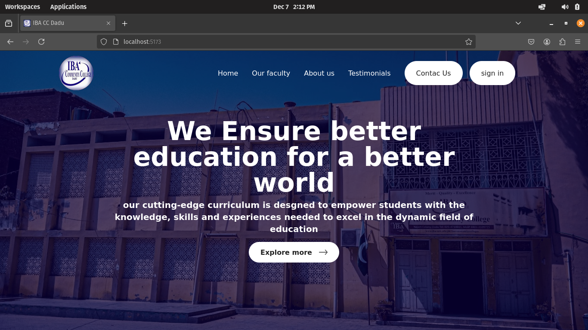
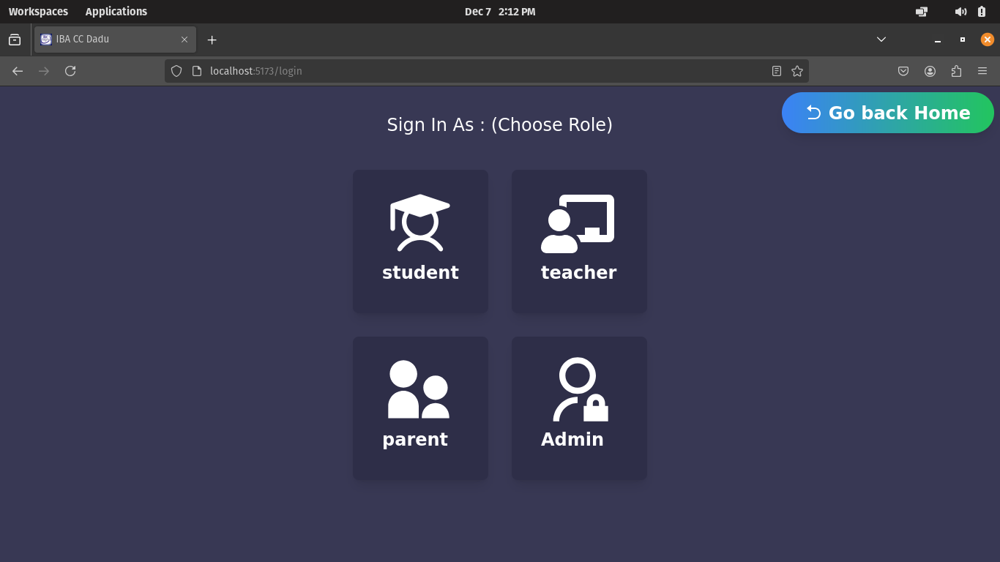
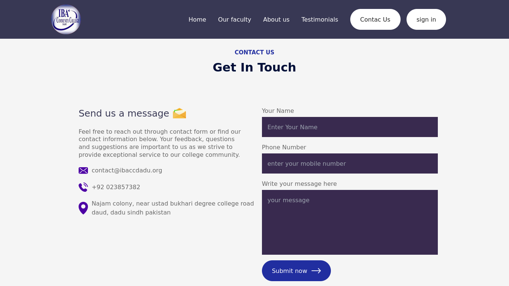
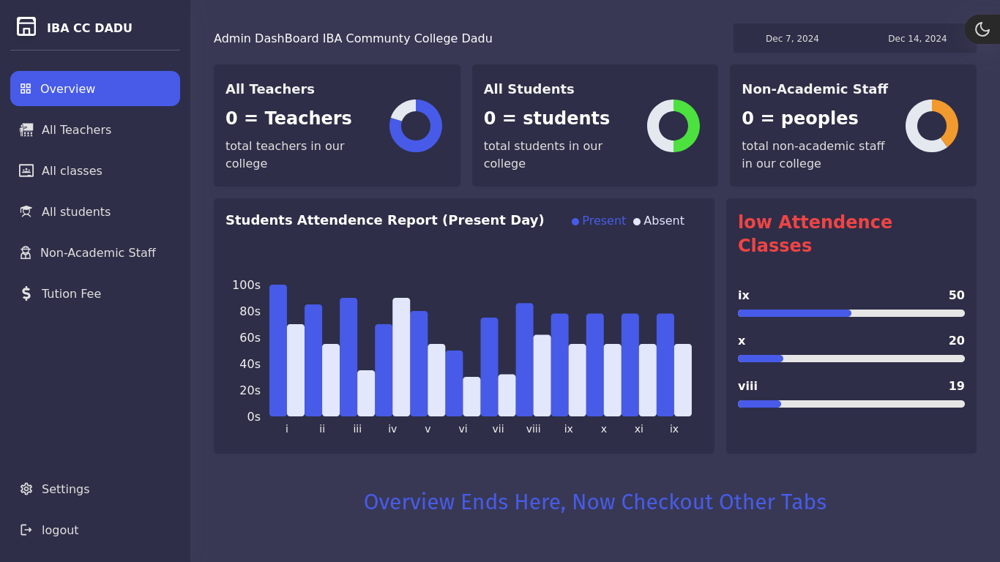
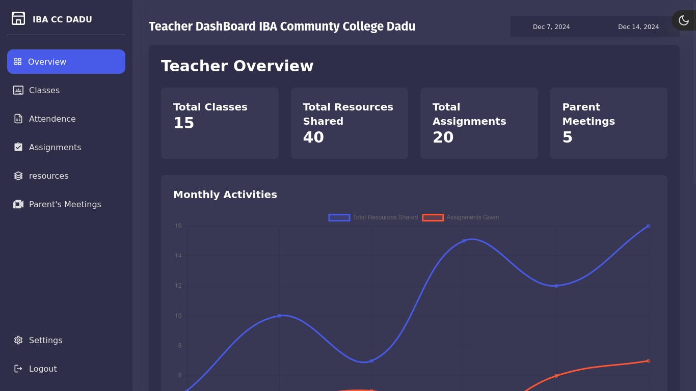
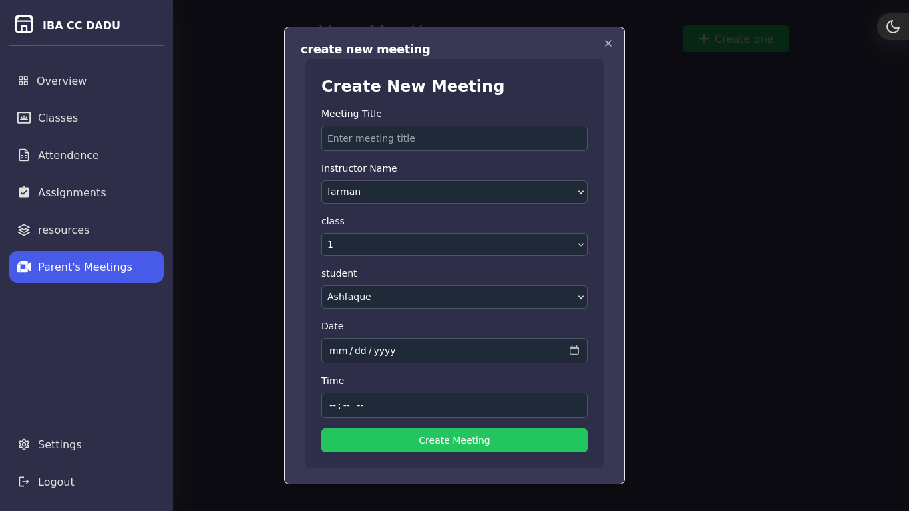
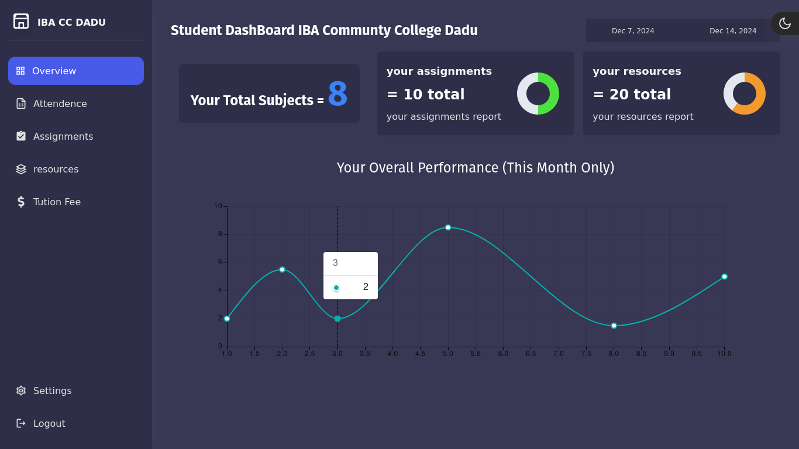
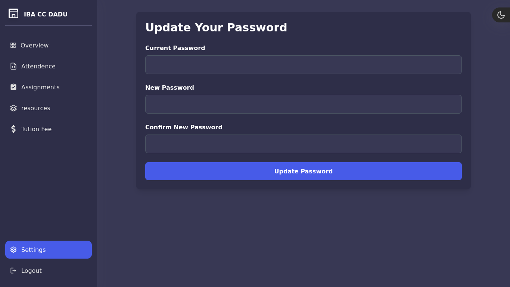
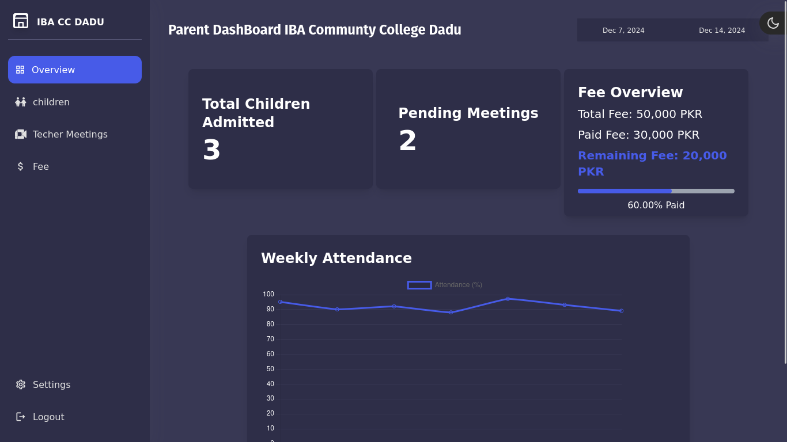
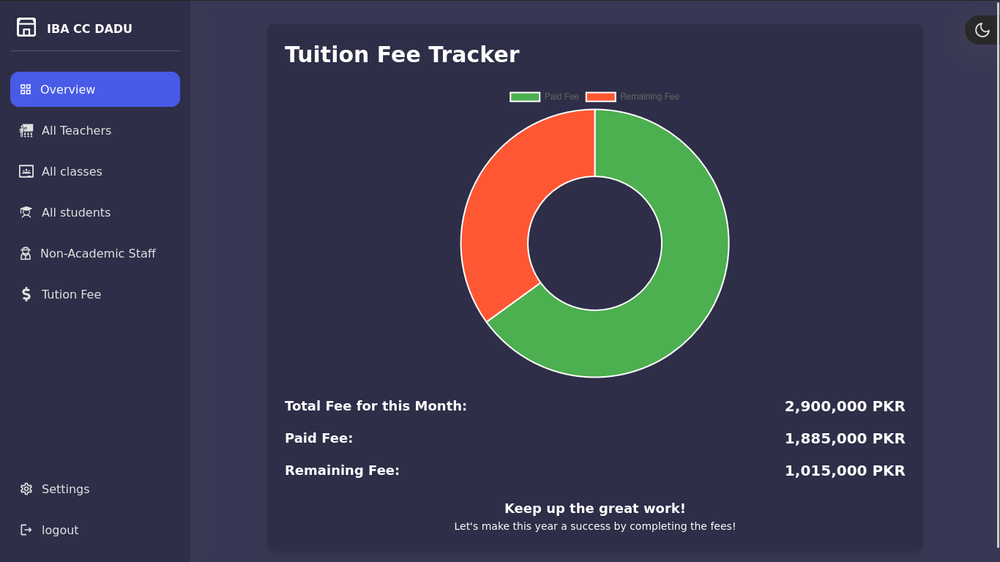

# IBA Community College Dadu - School Management System V2
## by : Ashfaque Ahmed (fullstack web developer)

 

### technologies used : 
 `== frontend : `
 -
 * ReactJS
  
 * Tailwind
  
 * ShadcnUI
  
 * MUI
  
 * Sass
  
 * Recharts
  
 * framer motion

 

 `== backend`
 -
 * NodeJS
  
 * ExpressJS
  
 * Socket.io
  
 * MongoDB
  
 * Mongoose ODM
  
 * JWT (JSON Web Tokens) Authentication and Authorization
 
 -

 ## 

## Project Screenshots : 
### Homepage

 
 
### Signin role selection page 

 
 
### Contact section

 
 
### Admin Dashboard

 
 
### Teacher Dashboard

 
 
### Teacher Dashboard PTM section

 
 
### Student Dashboard

 
 
### Student Dashboard Settings page

 
 
### Parent Dashboard

 
 
### Admin Dashboard fee tracker section

